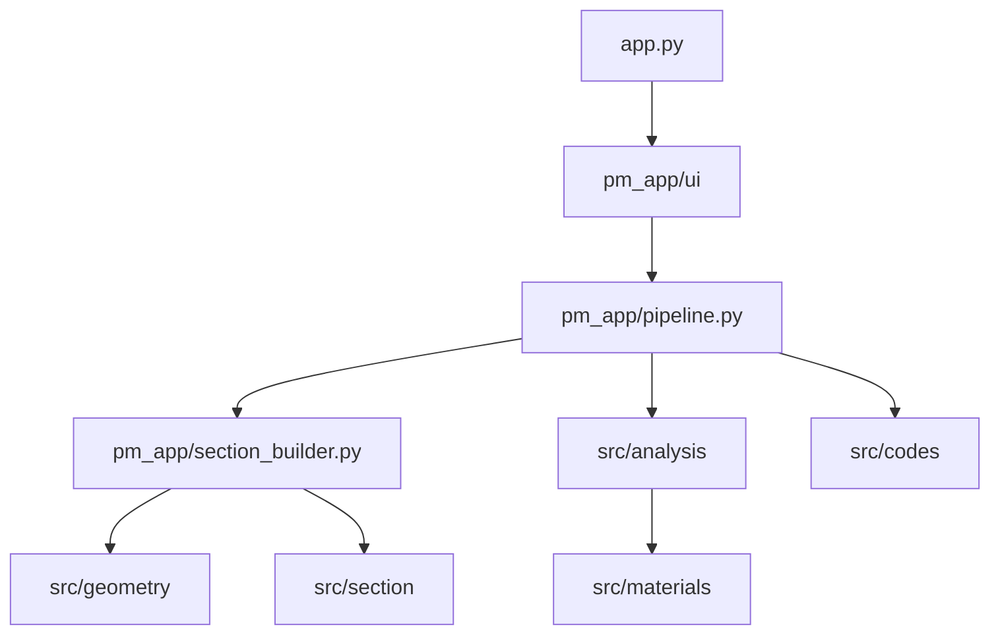

# Architecture

## Layers

## Data flow

1. **Input** — `render_input_panel()` → `AnalysisInputs`
2. **Run** — `run_pm_analysis(inputs)` → `pm_cache` dict → `st.session_state`
3. **Output** — `render_output_panel()` → `OutputContext.from_cache()` → tab modules
4. **Verify** — Tab 6 uses `VerifyContext` (from `ctx.to_verify()`)

## `pm_cache` keys (main)

| Key | Description |
|-----|-------------|
| `N_des`, `M_des` | Design strength curve |
| `N_nom`, `M_nom` | Nominal curve (φ=1) |
| `N_max_v`, `N_bal`, `M_bal` | Key capacity points |
| `section`, `geo`, `solver_out` | Fiber section + solver |
| `load_cases` | Per-case utilization |
| `Ag_theory`, `ny_fiber_used` | Mesh metadata |

## Session state

| Key | Purpose |
|-----|---------|
| `pm_cache` | Last analysis result |
| `inp_expand` | Input panel collapsed |
| `v_analysis_done` | Verification tab refresh flag |

## Extension points

- **New section type**: `pm_app/section_builder.py` + `src/geometry/`
- **New code**: `src/codes/` + register in `CODES`
- **New output tab**: `pm_app/ui/panel_output.py` or `pm_app/ui/tabs/`
